<!--
  OBSERVER — GitHub Profile README
  ---------------------------------------------------------
  Before pushing, find & replace the following placeholders
  across this file (Ctrl+Shift+H in most editors):

    Dey70   -> your GitHub username
    https://www.linkedin.com/in/rajdeep-dey-188784289/          -> your LinkedIn handle
    https://x.com/Observer_x70           -> your X / Twitter handle
    rajdeep.x70@gmail.com             -> your email address
    YOUR_PORTFOLIO_URL     -> your portfolio site
    https://github.com/Dey70/observer-os-web.git       -> repo name for Observer OS
    https://github.com/Dey70/WebNew-AI-Powered-Website-Translation-Platform.git            -> repo name for WebNew
    https://github.com/Dey70/WB-voice-translator.git         -> repo name for KothaSetu
    https://github.com/Dey70/EduGuardian-AI-Voice.git       -> repo name for EduGuardian

  Also see SETUP.md for the two required one-time steps
  (enabling the snake workflow, adding stats caching if
  you fork the stats services).
-->

<div align="center">



<br/>

<a href="https://github.com/Dey70">
  
</a>

<br/>


</div>

<br/>

<div align="center">
  <sub>◆ &nbsp; a quiet lattice pattern, a moving grid, a system that never stops logging &nbsp; ◆</sub>
</div>

<br/>

## &nbsp; About

<table width="100%">
<tr>
<td style="border: 1px solid #1E293B; border-radius: 12px; padding: 20px;">

**AI & Data Science student**, building products end-to-end — from model to interface to the infra in between.

- 🧠 &nbsp;AI & DS student, leaning toward the Data Scientist track
- 🛠️ &nbsp;Full-stack developer — comfortable owning a feature from schema to UI
- 🌱 &nbsp;Open source contributor, systems-over-motivation builder
- 🏗️ &nbsp;Currently building **Observer OS**, **KothaSetu**, and **CallSaathi**
- 📡 &nbsp;Learning distributed systems and studying LLM internals
- 🤖 &nbsp;Building AI agents and voice-call systems for real-world small businesses
- 🎯 &nbsp;Preparing for **GATE CSE 2027**

</td>
</tr>
</table>

<br/>

## &nbsp; Tech Stack

<table width="100%">
<tr>
<td valign="top" width="50%">

**Languages**


**Frontend**


**Backend**


</td>
<td valign="top" width="50%">

**Database**


**AI / ML**


**Tools & DevOps**


</td>
</tr>
</table>

<br/>

## &nbsp; Featured Projects

<table width="100%">
<tr>
<td width="50%" valign="top" style="border:1px solid #1E293B; border-radius:12px; padding:16px;">

<h3>Observer OS</h3>
<p><i>Personal AI performance-coaching operating system.</i></p>


<p>PWA with OAuth, Apple Health ingestion via Shortcuts, and a registry-based theme engine — including a fully designed Indian visual theme.</p>

<a href="https://github.com/Dey70/https://github.com/Dey70/observer-os-web.git"></a>
<a href="#"></a>
<a href="#"></a>

</td>
<td width="50%" valign="top" style="border:1px solid #1E293B; border-radius:12px; padding:16px;">

<h3>KothaSetu</h3>
<p><i>Bengali / Nepali / Hindi translation and West Bengal travel platform.</i></p>


<p>Live flight and hotel booking via flightapi.io and liteapi.travel, with a Story Design System and an interactive investor-facing prototype.</p>

<a href="https://github.com/Dey70/https://github.com/Dey70/WB-voice-translator.git"></a>
<a href="#"></a>
<a href="#"></a>

</td>
</tr>
<tr>
<td width="50%" valign="top" style="border:1px solid #1E293B; border-radius:12px; padding:16px;">

<h3>WebNew</h3>
<p><i>AI-powered website translation platform.</i></p>


<p>Translates and localizes full websites on the fly using LLM-driven content pipelines.</p>

<a href="https://github.com/Dey70/https://github.com/Dey70/WebNew-AI-Powered-Website-Translation-Platform.git"></a>
<a href="#"></a>
<a href="#"></a>

</td>
<td width="50%" valign="top" style="border:1px solid #1E293B; border-radius:12px; padding:16px;">

<h3>EduGuardian</h3>
<p><i>AI voice-calling system for parent outreach.</i></p>


<p>Attendance, academic, and behavior risk-tier calling with a persona-driven agent and multilingual SMS in English, Bengali, Assamese, and Nepali.</p>

<a href="https://github.com/Dey70/https://github.com/Dey70/EduGuardian-AI-Voice.git"></a>
<a href="#"></a>
<a href="#"></a>

</td>
</tr>
</table>

<br/>

## &nbsp; GitHub Statistics

<div align="center">


</div>

<div align="center">

[](https://github.com/Dey70)

</div>

<br/>

## &nbsp; Contribution Snake

<div align="center">

<picture>
  <source media="(prefers-color-scheme: dark)" srcset="https://raw.githubusercontent.com/Dey70/Dey70/output/dist/snake-dark.svg" />
  <source media="(prefers-color-scheme: light)" srcset="https://raw.githubusercontent.com/Dey70/Dey70/output/dist/snake-light.svg" />
  
</picture>

<sub>Generated nightly by <code>.github/workflows/snake.yml</code> from the live contribution graph.</sub>

</div>

<br/>

## &nbsp; Currently Learning

<table width="100%">
<tr>
<td align="center" width="20%"></td>
<td align="center" width="20%"></td>
<td align="center" width="20%"></td>
<td align="center" width="20%"></td>
<td align="center" width="20%"></td>
</tr>
</table>

<br/>

## &nbsp; Timeline

```
  Started Programming
          │
          ▼
  Full Stack Development
          │
          ▼
  AI Engineering
          │
          ▼
  Building Observer OS
          │
          ▼
  Open Source
          │
          ▼
  Preparing for GATE 2027
```

<br/>

## &nbsp; Quote

<div align="center">

</div>

<br/>

## &nbsp; Connect

<div align="center">

<a href="https://github.com/Dey70"></a>
<a href="https://linkedin.com/in/https://www.linkedin.com/in/rajdeep-dey-188784289/"></a>
<a href="YOUR_PORTFOLIO_URL"></a>
<a href="mailto:rajdeep.x70@gmail.com"></a>
<a href="https://twitter.com/https://x.com/Observer_x70"></a>

</div>

<br/>

<div align="center">


</div>

<br/>



<!-- easter egg: if you read the raw markdown this far — the jali pattern behind the banner is a quiet nod home. say hi. -->
